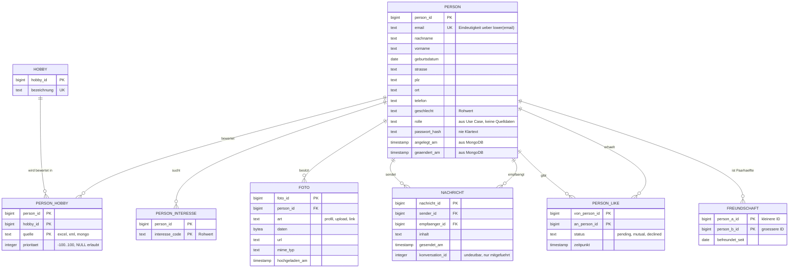

# Datenmodell LetsMeet — Konzept und Umsetzung

Stand: 26.08.2026 · Vorgehen: Wasserfall · Umsetzung: `src/main/resources/sql/`

Dieses Dokument ist der Entwurf **mit Begründung**. Beobachtungen und laufende
Entscheidungen gehören in [`results/befundnotiz.md`](../results/befundnotiz.md),
der fachliche Auftrag steht in [`readme.md`](../readme.md).

---

## 0. Vorgehen: Wasserfall, und wo er hier klemmt

Wasserfall heißt: jede Phase wird **abgeschlossen und freigegeben**, bevor die
nächste beginnt; Rückwärtsgehen ist ein Änderungsantrag, kein Normalfall.

| Phase | Ergebnis (Artefakt) | Zustand |
|---|---|---|
| 1 Analyse | Anforderungen, Quellenmessung, Schutzbedarf | freigegeben |
| 2 Konzeptueller Entwurf | ER-Modell (Entitäten, Beziehungen, Kardinalitäten) | freigegeben |
| 3 Logischer Entwurf | Relationenmodell, 3NF-Nachweis | freigegeben |
| 4 Physischer Entwurf | Datentypen, Schlüssel, Constraints, Indizes | freigegeben |
| 5 Implementierung | DDL-Skripte, View V1 | umgesetzt |
| 6 Test | Modelltest, Anwendungsfall-Abfragen | 20/20 bestanden |
| 7 Abnahme | Prüfstand V1 | Teil-Abnahme, siehe Phase 7 |

**Die ehrliche Einschränkung:** Reiner Wasserfall setzt voraus, dass die
Anforderungen zu Beginn vollständig vorliegen. Genau das ist hier nicht der
Fall — die Begleit-Website gibt Akt 2 erst frei, wenn Akt 1 steht, und Akt 3 ist
unbekannt. Wir haben deshalb **alles modelliert, was heute bekannt ist**
(Anwendungsfalldiagramm + Datenverträge V1 und V2), und führen unten ein
Änderungsprotokoll. Wer Wasserfall wählt, zahlt dafür mit späteren
Änderungsanträgen; das ist keine Panne, sondern der Preis der Methode. Für ein
Datenmodell ist der Preis vergleichsweise niedrig: Tabellen entstehen einmal,
Änderungen am Modell sind teurer als am Code — deswegen lohnt hier ein Entwurf
vorweg.

---

## 1. Phase 1 — Analyse

### 1.1 Anforderungen aus dem Anwendungsfalldiagramm

Aus [`images/use-case.png`](../images/use-case.png) — jeder Anwendungsfall
verlangt Daten:

| Anwendungsfall | Akteur | Was das Modell dafür braucht |
|---|---|---|
| Login / am System anmelden | Anwender | Kennung + Passwort-Prüfwert |
| Konto erstellen «extend» | Anwender | Person anlegbar ohne Fremddaten |
| eigene Stammdaten bearbeiten | Nutzer | Name, Adresse, Telefon, Geburtsdatum, Geschlecht |
| Hobbies bearbeiten, ergänzen, **priorisieren** «extend» | Nutzer | Hobby je Person **mit Rangwert** |
| Foto anfügen, ändern, löschen «extend» | Nutzer | mehrere Fotos je Person, eines davon Profilbild |
| Name und Hobbies eines ausgewählten Nutzers ausgeben | Nutzer | Lesezugriff über Personengrenze |
| andere Teilnehmer kontaktieren | Anwender | gerichtete Nachrichten |
| Nutzer mit ähnlichen Interessen finden | Anwender | Hobbys/Interessen vergleichbar, nicht als Textfeld |
| sich **gegenseitig** nach **beiderseitiger Zustimmung** in Freundeliste aufnehmen | Anwender, **Multiplizität 2** | Freundschaft als **Paar**, plus Zustimmungszustand |
| alle Daten bearbeiten | Administrator | **Rolle** an der Person |

Zwei Punkte fallen auf, die man ohne das Diagramm übersehen würde:

1. **Die Multiplizität 2** am Akteur „Anwender" beim Freundschafts-Anwendungsfall
   sagt: eine Freundschaft ist nichts Gerichtetes. Sie betrifft zwei Personen
   gleichzeitig und entsteht nach **beiderseitiger** Zustimmung.
2. **Login und Rollen** verlangen Daten, die in *keiner* Quelle stehen
   (Passwort, Rolle). Das Modell muss sie vorsehen, der Import kann sie nicht
   füllen. Wir tragen sie mit `NULL` bzw. Standardwert und schreiben dazu, warum.

### 1.2 Anforderungen aus den Datenverträgen

V1 verlangt `migration_users` mit sechs Spalten, V2 erweitert sie um `phone` und
`gender` und fordert vier weitere Views. Wichtig für das Modell: die Verträge
schreiben **die Sicht** vor, nicht die Tabellen („Die Tabellen hinter den
geforderten Datenbankansichten dürft ihr selbst entwerfen"). Daraus folgt die
Aufgabenteilung: Tabellen deutsch und nach unserem Modell, Views englisch nach
Vertrag, die Übersetzung passiert per `AS`.

### 1.3 Quellenmessung — worauf das Modell steht

Kein Modellentscheid ohne Zahl. Alles hier ist gemessen, nicht geschätzt:

| Messung | Ergebnis | Folge für das Modell |
|---|---|---|
| Postleitzahlen | 58 Personen mit vierstelliger PLZ, 15 mit führender Null | `plz text`, nicht `integer` |
| Gilt „PLZ bestimmt Ort"? | **Nein** — 54 PLZ mit mehreren Ortsschreibweisen (`17489` → „Greifswald" und „Greifswald Hansestadt") | keine Tabelle `plz → ort`; Adresse bleibt bei der Person |
| „Interessiert an" | Werte `m` (635), `w` (908), **`mw` (33)** | Mehrfachwert → eigene Tabelle |
| Geschlecht | `m`, `w`, **`nb`** — nicht „nonbinary" wie die Spaltenüberschrift | Rohwert, kein CHECK, keine Codetabelle |
| Hobby-Prioritäten in der Lieferung | 0…100 | Modelliert wird der **vereinbarte** Bereich −100…100 |
| Hobbynamen | 220 aus Excel, 30 aus XML, nur 4 Überschneidungen | Hobby als eigene Entität, `quelle` im Schlüssel |
| Likes | 500, davon **0 Gegen-Likes**, kein Selbst-Like, kein Paar doppelt | PK (von, an); Gegenseitigkeit steckt im `status`, nicht in einer zweiten Zeile |
| `friends`-Array (MongoDB) | bei **allen** 1576 Dokumenten leer | `freundschaft` wird modelliert, bleibt aber leer |
| `conversation_id` | 50 Werte (1…50), **48 davon bei mehr als einem Teilnehmerpaar**; alle 300 Paare haben genau eine Nachricht | **keine** Tabelle `konversation`, kein Fremdschlüssel — die id kann keine Zweierkonversation bezeichnen |
| Stammdaten Excel ↔ MongoDB | 7 Namen und 3 Telefonnummern widersprechen sich | `angelegt_am`/`geaendert_am` mitführen — der einzige Hinweis auf Aktualität |

Nachmessen könnt ihr das so:

```bash
docker exec lf8_lets_meet_mongodb_container mongosh LetsMeet --quiet --eval 'printjson(db.users.findOne())'
```

```sql
SELECT plz, count(DISTINCT ort) FROM person GROUP BY plz HAVING count(DISTINCT ort) > 1;
```

Der zweite Befehl läuft erst nach dem Import — bis dahin gilt die Messung an der
Excel-Datei. **Prüft die Zahlen selbst nach, bevor ihr sie im Fachgespräch
vertretet.**

### 1.4 Schutzbedarf

| Datenart | Einordnung | Folge |
|---|---|---|
| Name, Adresse, Geburtsdatum, Telefon, E-Mail | personenbezogen, Art. 4 Nr. 1 DSGVO | Datensparsamkeit, Löschbarkeit |
| Geschlecht **+** „Interessiert an" | ergibt die **sexuelle Orientierung** → besondere Kategorie, **Art. 9 DSGVO** | Verarbeitung nur mit ausdrücklicher Einwilligung |
| Nachrichteninhalte | Kommunikationsinhalt | kein Export, kein Log |
| Passwort | Zugangsdaten | **nur** als Hash, Spalte heißt deshalb `passwort_hash` |
| Profilbild | Bilddaten, mittelbar biometrienah | eigene Tabelle, nicht in jeder Stammdatenabfrage mitgeladen |

Im Modell umgesetzt: alle Fremdschlüssel auf `person` mit `ON DELETE CASCADE` —
das Recht auf Löschung (Art. 17) ist damit ein `DELETE`, kein Aufräumskript.

---

## 2. Phase 2 — Konzeptueller Entwurf



### Beziehungen mit Kardinalitäten

| Beziehung | Typ | (min,max) | Anmerkung |
|---|---|---|---|
| Person **bewertet** Hobby | m:n mit Attributen | Person (0,n) ↔ Hobby (0,n) | `prioritaet`, `quelle` sind Beziehungsattribute |
| Person **sucht** Interesse | 1:n | Person (0,n) | Mehrfachwert der Quelle |
| Person **besitzt** Foto | 1:n | Person (0,n) ↔ Foto (1,1) | höchstens ein `profil` |
| Person **sendet/empfängt** Nachricht | zwei 1:n | Nachricht (1,1) je Rolle | gerichtet |
| Person **gibt/erhält** Like | rekursiv m:n | (0,n) je Richtung | gerichtet, kein Selbstbezug |
| Person **befreundet mit** Person | rekursiv m:n, **symmetrisch** | (0,n) | eine Zeile je Paar |

### Entwurfsentscheidungen mit verworfener Alternative

**E1 — Adresse als Attribute der Person, nicht als eigene Entität.**
Verworfen: `adresse`-Tabelle mit 1:1-Beziehung. Sie hätte einen Join für jede
Stammdatenabfrage gekostet, ohne eine einzige Redundanz zu beseitigen — eine
Person hat in diesen Daten genau eine Adresse, und Adressen werden nicht
geteilt. Ebenfalls verworfen: `plz → ort` als Nachschlagetabelle, siehe die
Messung in 1.3 — die Abhängigkeit gilt nicht.

**E2 — Freundschaft symmetrisch, eine Zeile je Paar.**
Erzwungen durch `CHECK (person_a_id < person_b_id)`: `(5,9)` ist erlaubt,
`(9,5)` nicht. Verworfen: zwei gerichtete Zeilen je Freundschaft. Die wären
beim Lesen bequemer (`WHERE person_id = ?`), müssten aber per Trigger
paarweise konsistent gehalten werden — sonst gibt es halbe Freundschaften. Wir
zahlen den Preis beim Lesen (`CASE` in der Abfrage, siehe
`910_anwendungsfall_abfragen.sql`) und kaufen dafür Unmöglichkeit statt
Disziplin.

**E3 — `konversation_id` bleibt Attribut, es gibt keine Entität `Konversation`.**
Die naheliegende Modellierung („eine Nachricht gehört zu einer Konversation,
eine Konversation hat zwei Teilnehmer") ist an diesen Daten **nachweislich
falsch**: 48 der 50 ids kommen bei mehreren Teilnehmerpaaren vor. Wir führen
die Zahl unverändert mit, wie der Vertrag es verlangt, und deuten sie nicht.
Das ist eine Kundinnenfrage, kein Modellierungsproblem.

**E4 — Surrogatschlüssel `person_id`, E-Mail bleibt Schlüsselkandidat.**
Verworfen: E-Mail als Primärschlüssel. Sie ist eindeutig (Vertrag) und wäre
fachlich sauber, aber sie ist veränderlich und würde als Fremdschlüssel in
sechs Tabellen liegen; eine Adressänderung wäre dann ein Update über das halbe
Modell. Zusätzlich verworfen: eine Spalte `email_key` mit `lower(email)` — das
ist abgeleiteter, doppelt gepflegter Wert. Ein **funktionaler UNIQUE-Index auf
`lower(email)`** leistet dasselbe ohne zweite Spalte.

**E5 — `quelle` im Primärschlüssel von `person_hobby`.**
Der Vertrag sagt „dasselbe Hobby aus derselben Quelle erscheint nur einmal" —
also je Quelle einmal. Preis: wer gemeinsame Hobbys zählt, braucht
`count(DISTINCT hobby_id)`, sonst zählt ein Hobby doppelt. Steht als Kommentar
in der Abfrage.

---

## 3. Phase 3 — Logischer Entwurf und Normalisierung

Relationen in Kurzschreibweise (unterstrichen = Primärschlüssel, *kursiv* =
Fremdschlüssel):

```
person(person_id, email, nachname, vorname, geburtsdatum, strasse, plz, ort,
       telefon, geschlecht, rolle, passwort_hash, angelegt_am, geaendert_am)
hobby(hobby_id, bezeichnung)
person_hobby(person_id*, hobby_id*, quelle, prioritaet)
person_interesse(person_id*, interesse_code)
person_like(von_person_id*, an_person_id*, status, zeitpunkt)
nachricht(nachricht_id, sender_id*, empfaenger_id*, inhalt, gesendet_am, konversation_id)
freundschaft(person_a_id*, person_b_id*, befreundet_seit)
foto(foto_id, person_id*, art, daten, url, mime_typ, hochgeladen_am)
```

### 3NF-Nachweis

**1NF (Atomarität).** Die Quelle verletzt sie dreifach, das Modell löst es auf:

| Quelle | Verstoß | Auflösung |
|---|---|---|
| `Hobby1 %Prio1%; …` | bis zu 5 Werte in einer Zelle | `hobby` + `person_hobby`, eine Zeile je Zuordnung |
| `Interessiert an` = `mw` | zwei Werte in einer Zelle | `person_interesse`, eine Zeile je Code |
| `Nachname, Vorname` / `Straße Nr, PLZ Ort` | mehrere Angaben in einer Zelle | getrennte Spalten |

**2NF (volle Abhängigkeit vom Gesamtschlüssel).** Nur bei zusammengesetzten
Schlüsseln prüfbar. `person_hobby` hat den Schlüssel (person_id, hobby_id,
quelle); `prioritaet` hängt von allen drei Teilen ab — dieselbe Person kann
dasselbe Hobby aus zwei Quellen mit unterschiedlicher Priorität haben. Die
Hobby*bezeichnung* hängt dagegen nur von `hobby_id` ab und liegt deshalb in
`hobby`, nicht hier. Gleiches Muster in `person_like`, `freundschaft`,
`person_interesse`.

**3NF (keine transitiven Abhängigkeiten).** Geprüft, Kandidat für Kandidat:

- `plz → ort`? **Nachgemessen: gilt nicht** (54 Gegenbeispiele). Keine
  Auslagerung — sie wäre Datenverlust, nicht Normalisierung.
- `email → alles`? `email` ist Schlüsselkandidat, nicht Nicht-Schlüsselattribut
  — kein 3NF-Fall.
- `geschlecht`, `interesse_code`, `status` → Bezeichnung? Wäre der klassische
  Fall für eine Codetabelle. Der Vertrag verbietet sie ausdrücklich („legt keine
  eigene Codetabelle an"), und ohne Klartextspalte gibt es auch keine transitive
  Abhängigkeit.
- `mime_typ → Dateiendung`? Ableitbar, aber die Endung wird nicht gespeichert.

**Bewusst nicht in 3NF überführt: nichts.** Was wie ein Verstoß aussieht
(Adresse bei der Person), ist keiner — die vermutete Abhängigkeit existiert in
diesen Daten nicht.

---

## 4. Phase 4 — Physischer Entwurf (PostgreSQL)

### Datentypen

| Entscheidung | Grund |
|---|---|
| `plz text` | vierstellige PLZ und führende Nullen; `integer` macht `06221` zu `6221` |
| `prioritaet integer`, NULL erlaubt | XML liefert keine Priorität; erfundene 0 läge mitten im Wertebereich |
| `timestamp` (ohne Zeitzone) | Quelle liefert ISO-8601 **ohne** Zone; eine Zone zu erfinden wäre eine Aussage |
| `bytea` fürs Profilbild | „direkt gespeichertes Profilbild" laut Auftrag |
| `bigint GENERATED ALWAYS AS IDENTITY` | Standard-SQL statt `serial`; „ALWAYS" verhindert versehentlich eigene IDs |

### Constraint-Politik (die Regel, nach der wir entschieden haben)

> **Eingeschränkt wird nur, was vereinbart ist oder unser eigenes Vokabular
> ist. Rohwerte aus den Quellen bekommen keinen CHECK.**

| Constraint | Warum erlaubt |
|---|---|
| `prioritaet BETWEEN -100 AND 100` | Wertebereich ist laut readme „fachlich mit der Kundin vereinbart" |
| `quelle IN ('excel','xml','mongo')` | unser eigenes Vokabular |
| `art IN ('profil','upload','link')` | unser eigenes Vokabular |
| `rolle IN (...)` | aus dem Anwendungsfalldiagramm abgeleitet |
| `btrim(email) <> ''`, UNIQUE `lower(email)` | steht so im Datenvertrag |
| `von <> an`, `sender <> empfänger` | gemessen (kein Selbstbezug) **und** durch Anwendungsfall gedeckt |
| `person_a_id < person_b_id` | Symmetrie aus dem Anwendungsfalldiagramm |

**Kein CHECK** auf `geschlecht`, `interesse_code`, `status` und `plz`: das sind
Rohwerte. Ein CHECK auf beobachtete Werte würde eine spätere Lieferung mit
einem neuen Wert zum Absturz bringen, obwohl der Vertrag genau diesen Wert
unverändert verlangt. Plausibilität prüfen wir dort per Abfrage:

```sql
SELECT geschlecht, count(*) FROM person GROUP BY 1 ORDER BY 2 DESC;
SELECT plz FROM person WHERE plz !~ '^[0-9]+$';
```

Nebenbefund aus dem Entwurf: `CHECK (geburtsdatum <= CURRENT_DATE)` **wird von
PostgreSQL angenommen** — wir haben es ausprobiert. Wir benutzen es trotzdem
nicht: die Prüfung läuft nur beim Schreiben, und ein `pg_restore` in der
Zukunft kann an einer Zeile scheitern, die beim Einfügen gültig war. Solche
Plausibilität gehört in eine Abfrage, nicht in ein Constraint.

### Indizes

| Index | Zweck |
|---|---|
| `person_email_eindeutig` UNIQUE auf `lower(email)` | Vertragszusage + Join-Schlüssel aller Quellen |
| `nachricht_sender_idx`, `nachricht_empfaenger_idx` | Fremdschlüssel ohne Index sind langsam bei `DELETE` der Person |
| `foto_ein_profilbild_je_person` UNIQUE **WHERE art = 'profil'** | Teilindex: genau ein Profilbild, beliebig viele weitere Fotos |

Primär- und Unique-Schlüssel bringen ihre Indizes selbst mit; mehr braucht es
bei 1576 Personen nicht. Weitere Indizes erst, wenn eine Abfrage nachweislich
langsam ist.

---

## 5. Phase 5 — Implementierung

| Datei | Inhalt |
|---|---|
| [`010_schema.sql`](../src/main/resources/sql/010_schema.sql) | Kern: `person` (alles, was V1 braucht) |
| [`020_views_v1.sql`](../src/main/resources/sql/020_views_v1.sql) | Datenvertrag V1: `migration_users` |
| [`030_schema_akt2.sql`](../src/main/resources/sql/030_schema_akt2.sql) | Akt 2: Hobbys, Interessen, Likes, Nachrichten, Freundschaften, Fotos |
| [`040_views_v2.sql`](../src/main/resources/sql/040_views_v2.sql) | Datenvertrag V2 — **offen**, Vertrag und ein Beispiel stehen drin |
| [`900_modelltest.sql`](../src/main/resources/sql/900_modelltest.sql) | prüft die Zusagen des Modells |
| [`910_anwendungsfall_abfragen.sql`](../src/main/resources/sql/910_anwendungsfall_abfragen.sql) | je Anwendungsfall eine Abfrage |

Anwenden, in dieser Reihenfolge:

```bash
for f in 010_schema.sql 020_views_v1.sql 030_schema_akt2.sql; do docker exec -i lf8_lets_meet_postgres_container psql -U user -d lf8_lets_meet_db -v ON_ERROR_STOP=1 < src/main/resources/sql/$f; done
```

Für Akt 1 genügen `010` und `020`.

---

## 6. Phase 6 — Test

```bash
docker exec -i lf8_lets_meet_postgres_container psql -U user -d lf8_lets_meet_db -v ON_ERROR_STOP=1 < src/main/resources/sql/900_modelltest.sql
```

Ergebnis am 26.08.2026: **20 von 20 Prüfungen bestanden, Exit-Code 0.** Der Test
legt Testdaten an und rollt am Ende alles zurück — die Datenbank bleibt, wie sie
war. Geprüft wird unter anderem:

- gleiche E-Mail in anderer Schreibweise → abgewiesen
- dasselbe Hobby zweimal aus derselben Quelle → abgewiesen; aus **anderer**
  Quelle → angenommen
- Priorität −100 → angenommen, 101 → abgewiesen
- Like/Nachricht auf sich selbst → abgewiesen
- Gegenrichtung einer bestehenden Freundschaft → abgewiesen
- zweites Profilbild derselben Person → abgewiesen, weiteres Foto → angenommen
- `DELETE` einer Person → alle abhängigen Zeilen verschwinden mit

Dazu laufen die 11 Anwendungsfall-Abfragen fehlerfrei gegen das Schema — das
Modell kann jeden Anwendungsfall des Diagramms beantworten.

---

## 7. Phase 7 — Abnahme

Prüfstand V1 gegen das leere Modell:

```
✔ Vertrags-View und Spaltentypen      View migration_users entspricht dem vereinbarten Spaltensatz.
✔ Schlüsselqualität email             Jede Zeile hat eine eindeutige, nicht leere E-Mail-Adresse.
✔ Feldabgleich gegen die Quelle       Alle verglichenen Feldwerte stimmen zeichengenau überein.
✘ Vollständigkeit des Bestands        Bestand: 0 von 1.576 Zeilen.
```

**Das ist die richtige rote Zeile.** Was am Modell hängt, ist grün: Spaltensatz,
Typen, Schlüsselqualität. Rot ist allein die Vollständigkeit — die füllt der
Import, und der ist nicht Teil dieses Entwurfs. Das Gerüst dafür liegt in
`parse/RowSplitter` mit roten Tests, der Weg steht in
[`START.md`](../START.md).

---

## 8. Änderungsprotokoll und offene Punkte

Wasserfall heißt: ab hier ändert sich das Modell nur über einen begründeten
Änderungsantrag. Diese Antworten würden einen auslösen:

| # | Offene Frage | Was sich am Modell ändern würde |
|---|---|---|
| 1 | Ist eine Freundschaft dasselbe wie ein Like mit `status = 'mutual'`? | `freundschaft` fällt weg und wird eine Sicht auf `person_like` — 158 Zeilen statt 0 |
| 2 | Was bedeutet `konversation_id`, wenn sie mehrere Paare umfasst? | ggf. Entität `konversation` + Teilnehmertabelle (m:n) |
| 3 | Welche Quelle gewinnt bei widersprechenden Stammdaten? | keine Strukturänderung, aber eine Importregel — und evtl. eine Herkunftsspalte je Feld |
| 4 | Darf ein Platzhalter (`phone = '0'`) gewinnen? | siehe 3 |
| 5 | Ist `mw` ein Wert oder zwei? | zwei Zeilen (heute) oder eine — betrifft `person_interesse` |
| 6 | Kommen Passwörter und Rollen je aus einer Quelle? | sonst bleiben `passwort_hash`/`rolle` dauerhaft leer und wären zu entfernen (Datensparsamkeit) |

| Datum | Änderung | Grund |
|---|---|---|
| 26.08.2026 | Erstfassung, Phasen 1–7 | — |

---

## 9. Prüffragen fürs Fachgespräch

Wer den Entwurf vertritt, sollte das beantworten können — schriftlich üben lohnt:

1. Warum ist die Adresse **nicht** in eine eigene Tabelle ausgelagert, obwohl
   „PLZ bestimmt Ort" nach 3NF-Verstoß klingt?
2. Warum steht `quelle` im Primärschlüssel von `person_hobby` — und was kostet
   das bei der Abfrage „gemeinsame Hobbys"?
3. Warum `plz text` und nicht `integer`?
4. Was macht der `CHECK (person_a_id < person_b_id)`, und welche Alternative
   wurde dafür verworfen?
5. Warum hat `geschlecht` keinen CHECK, `prioritaet` aber schon?
6. Warum gibt es keine Tabelle `konversation`? (Antwort mit Zahl)
7. Wozu die View, wenn die App auch direkt auf `person` schauen könnte?
8. Was passiert bei `DELETE FROM person WHERE …` — und warum ist das für
   Art. 17 DSGVO relevant?
9. Welche Spalten hat der Entwurf, für die es **keine** Quelldaten gibt, und
   warum sind sie trotzdem drin?
10. Wo klemmt Wasserfall in diesem Projekt?
